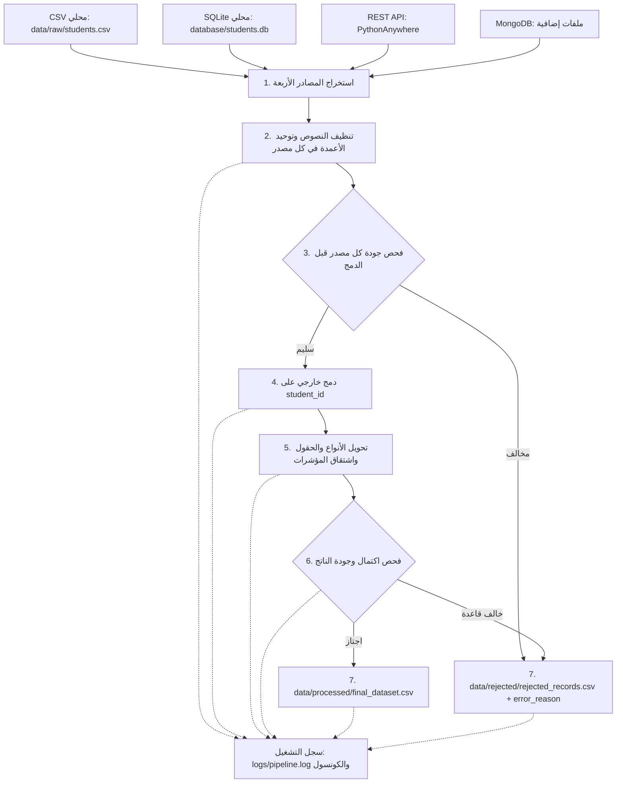

# وثيقة مشروع تكامل بيانات الطلاب

## 1. الغرض من الوثيقة والمشروع

توثّق هذه الصفحة مكوّنات مشروع `student_data_pipeline` وطريقة انتقال بيانات الطلاب من مصادرها المختلفة إلى ملفات النتائج. المشروع تطبيق ETL دفعي مكتوب بـPython؛ يستخرج بيانات متباينة البنية، ويهيئها ويدمجها، ثم يتحقق من جودتها ويصدر السجلات المقبولة والمرفوضة إلى CSV.

المصطلحات المستخدمة:

- **المصدر (Source):** ملف أو قاعدة بيانات أو خدمة توفر بيانات الإدخال.
- **السجل (Record):** صف يمثل طالبًا، ويُستخدم `student_id` لمطابقة السجلات.
- **السجل المقبول:** سجل اجتاز قواعد التحقق المطبقة في `app/validation/quality.py`.
- **السجل المرفوض:** سجل خالف قاعدة واحدة أو أكثر؛ تحفظ أسباب رفضه في `error_reason`.

> **حدود النظام:** يقرأ المشروع البيانات من المصادر، لكنه لا يكتب تغييرات إلى SQLite أو MongoDB أو خدمة API. وجهة التحميل الحالية هي ملفا CSV المحليان.

## 2. نظرة عامة على المعمارية وتدفق البيانات

تبدأ عملية التشغيل من `main.py`، الذي يستدعي وحدات المصدر والتنظيف والتحقق والدمج والتحويل والتصدير بالتسلسل. تنظف المصادر الأربعة وتفحص قبل الدمج، ثم يخضع الناتج لفحص نهائي.



### مراحل التنفيذ بالترتيب

| المرحلة | ما يحدث | المدخلات | الناتج |
|---|---|---|---|
| 1. الاستخراج | قراءة CSV وSQLite، طلب API، وقراءة MongoDB. API وMongoDB لديهما مسارات تعامل مع بعض حالات التعذر. | أربعة مصادر مستقلة | أربعة جداول بيانات (DataFrames) |
| 2. التنظيف | توحيد أسماء الأعمدة والنصوص والمدن وإزالة الصفوف المتطابقة في كل مصدر؛ تبقى القوائم والكائنات المتداخلة سليمة. | جداول المصادر | جداول منقحة |
| 3. فحص المصدر | فحص المعرّف وتكراره والقيم المقيدة الموجودة في كل مصدر قبل الدمج. تسجل السجلات المخالفة مع اسم المصدر وسبب الرفض. | جداول منقحة | مصادر سليمة للدمج وسجلات مرفوضة مبكرًا |
| 4. الدمج | دمج خارجي على `student_id`. يفشل الدمج برسالة واضحة إذا احتوى مصدر غير فارغ على مفتاح مفقود أو غير صالح أو مكرر. | المصادر السليمة | جدول موحد للطلاب |
| 5. التحويل | تحويل الأنواع واشتقاق التصنيفات وتسلسل القوائم. | الجدول الموحد | جدول محول |
| 6. الفحص النهائي | التحقق من وجود الحقول التحليلية الأساسية وصحة حدودها. | الجدول المحول | جدول مقبول وجدول مرفوض |
| 7. التحميل والتسجيل | كتابة ملفي CSV وتسجيل التكرارات والقيم المفقودة وأعداد النتائج ووقت التنفيذ. | الجدولان المقبول والمرفوض | ملفات النتائج وسجل التشغيل |

## 3. مصادر البيانات وعقودها

مفتاح المطابقة بين المصادر هو `student_id`. ينبغي توفيره في كل مصدر لربط السجلات على أساس الطالب.

| المصدر | الموقع أو الاتصال | البيانات المتوقعة | الملاحظات |
|---|---|---|---|
| CSV | `data/raw/students.csv` | `student_id`, `name`, `age`, `city`, `email` | معلومات ديموغرافية. أسماء الأعمدة والقيم النصية تخضع للتنظيف المسبق. |
| SQLite | `database/students.db` | `student_id`, `major`, `enrollment_year`, `gpa`, `total_credits` | يستخرجها استعلام يربط `academic_profiles` و`academic_grades` باستخدام `INNER JOIN` على المعرّف. |
| REST API | `https://emranyaseen.pythonanywhere.com/my-json` | `student_id`, `attendance_rate` | خدمة خارجية مستضافة على **PythonAnywhere**. بيانات هذه الخدمة أنشأها صاحب المشروع على الموقع، والخط يطلبها عبر HTTP عند التشغيل؛ ليست قاعدة بيانات أنشأها المشروع محليًا. |
| MongoDB | الإعدادات من `.env`؛ الافتراضي `student_pipeline.student_extra` | `student_id` وحقول الملف الإضافي، مثل العنوان والاتصال والوصي والمهارات والدورات والمشاريع | المستندات المتداخلة تُسطح إلى أعمدة مثل `contact.phone` و`address.city`. يستبعد الحقل الداخلي `_id`. |

### 3.1 ملف CSV

يقرأ `app/sources/csv_source.py` الملف باستخدام pandas. الملف غير الموجود خطأ يوقف الاستخراج ويرفع `FileNotFoundError`؛ أما الملف الموجود لكنه خالٍ تمامًا فيعيد مصدر CSV جدولًا فارغًا مع تسجيل تحذير. مثال للأعمدة المتوقعة:

```csv
student_id,name,age,city,email
101,Ahmed Ali,21,cairo,ahmed.ali@example.com
```

تحتوي عينة المشروع على حالات مفيدة للتحقق، مثل تكرار المعرّف، أو غياب المعرّف، أو عمر خارج الحدود؛ وقد تتغير البيانات والنتائج عند تحديث العينة.

### 3.2 قاعدة SQLite

يستخدم `app/sources/database_source.py` الاستعلام الافتراضي الآتي:

```sql
SELECT
    p.student_id,
    p.major,
    p.enrollment_year,
    g.gpa,
    g.total_credits
FROM academic_profiles p
INNER JOIN academic_grades g ON p.student_id = g.student_id
```

بما أن الربط `INNER JOIN`، لا تظهر في ناتج المصدر إلا السجلات التي لها صف مطابق في الجدولين. الملف غير الموجود أو خطأ SQL يوقف التنفيذ ويُرفع كخطأ، بخلاف حالات تعذر API أو MongoDB التي لها سلوك بديل موضح أدناه.

### 3.3 خدمة REST API المستضافة على PythonAnywhere

يستدعي `main.py` عنوان الخدمة المذكور أعلاه عبر `fetch_api_source`. يقوم القارئ بطلب HTTP، ويقبل استجابة JSON على أحد الأشكال التالية:

```json
[
  {"student_id": 101, "attendance_rate": 92.5}
]
```

أو قائمة ضمن `data` أو `attendance`:

```json
{
  "data": [
    {"student_id": 101, "attendance_rate": 92.5}
  ]
}
```

الخدمة هي نقطة استضافة خارجية على PythonAnywhere، والبيانات المعروضة فيها أُنشئت لهذا المشروع بواسطة صاحبه. عنوانها مضبوط حاليًا مباشرة داخل `main.py` وليس في `.env`.

مهلة الطلب الافتراضية خمس ثوانٍ. عند غياب العنوان، أو أخطاء الاتصال وHTTP والمهلة، أو JSON غير صالح، يستخدم القارئ بيانات الحضور الاحتياطية الموجودة في `app/sources/api_source.py` افتراضيًا. يمكن تعطيل هذا السلوك عند استدعاء الدالة بتمرير `use_fallback_on_error=False`، لكن `main.py` لا يغير القيمة الافتراضية. إذا كانت الاستجابة JSON سليمة لكنها فارغة، فستكون النتيجة جدولًا فارغًا ولا تُستبدل تلقائيًا ببيانات fallback.

### 3.4 MongoDB

يقرأ `app/sources/mongodb_source.py` مجموعة MongoDB المحددة في الإعدادات. يتحقق من الاتصال، ويقرأ المستندات دون `_id`، ثم يستخدم `pandas.json_normalize` لتسطيح الحقول المتداخلة. تشمل البيانات الإضافية المتوقعة:

- بيانات الاتصال والعنوان والوصي.
- قوائم `skills` و`courses` و`projects`.

المجموعة الفارغة أو بعض أخطاء الاتصال والتهيئة تؤدي إلى تسجيل تحذير أو خطأ وإرجاع جدول فارغ؛ بالتالي يمكن أن يكمل الدمج من المصادر الأخرى. هذا يعني أن غياب سجلات MongoDB قد يكون نتيجة تعذر الاتصال، وليس بالضرورة عدم وجود بيانات للطلاب.

## 4. التنظيف والتكامل بين المصادر

### 4.1 التنظيف المسبق

تنفذ `clean_student_data` على كل مصدر قبل فحص الجودة والدمج، وتشمل:

1. إزالة المسافات من أسماء الأعمدة وتحويلها إلى أحرف صغيرة واستبدال المسافات والشرطات السفلية.
2. إزالة المسافات الزائدة من القيم النصية ومعالجة النصوص الفارغة و`nan` و`None` بوصفها قيمًا مفقودة، مع عدم تحويل القوائم والكائنات إلى نصوص.
3. توحيد كتابة المدن المعروفة، مثل `cairo` و`el cairo` إلى `Cairo`، و`alex` إلى `Alexandria`.
4. توحيد تنسيق الأسماء إلى Title Case مع مسافة واحدة بين الأجزاء.
5. إزالة الصفوف المتطابقة تمامًا وتسجيل عددها في ملخص التشغيل.

توحّد القيم النصية العامة في كل مصدر، وتوحّد أسماء المدن المعروفة في العمود `city`. المدينة المتداخلة `address.city` لا تمر بخريطة المدن ما لم توحّد ضمن حقل `city` لاحقًا.

### 4.2 التحقق قبل الدمج

تنفذ `validate_source_records` على كل جدول منقح قبل التكامل. يجب أن يكون `student_id` موجودًا وصحيحًا وموجبًا وفريدًا داخل المصدر. كما تفحص الحدود الرقمية وصيغة البريد عندما يوفر المصدر هذه الحقول. يسجل كل صف مرفوض مع `source_name` و`rejection_stage` و`error_reason`، ويستمر الدمج بالسجلات السليمة من بقية المصادر.

### 4.3 سياسة الدمج

تدمج `integrate_sources` المصادر بترتيبها في `main.py`: CSV، ثم SQLite، ثم API، ثم MongoDB.

- النوع المستهدف لمفتاح الربط هو `Int64` القابل للقيم الفارغة.
- تزال الصفوف المتطابقة تمامًا في التنظيف. أما الصفوف المختلفة التي تشترك في `student_id` فترفض قبل الدمج؛ لا يختار الخط سجلًا منها بصمت.
- يستخدم الدمج `outer join`؛ لذلك يحتفظ بطلاب يظهرون في مصدر واحد فقط، حتى عند عدم وجود سجل مطابق في بقية المصادر.
- عند وجود العمود نفسه في مصدرين، تُفضّل القيمة الموجودة في الجدول المدمج حاليًا، وتُستخدم قيمة المصدر اللاحق لملء الخانة الفارغة.
- إذا لم يوجد عمود `student_id` أو كان المفتاح غير صالح أو مكررًا في مصدر غير فارغ، يفشل الدمج بـ`ValueError` بدل إلحاق صفوف غير مطابقة باستخدام `concat`.
- إذا كانت جميع جداول المصادر فارغة، يعيد الدمج جدولًا فارغًا.

## 5. التحويلات والحقول المشتقة

تطبق `transform_student_data` التحويلات بعد الدمج:

| الحقل | التحويل |
|---|---|
| `student_id`, `age`, `enrollment_year`, `total_credits` | تحويل رقمي إلى نوع صحيح قابل للقيم الفارغة `Int64`؛ القيم غير الرقمية تتحول إلى قيمة مفقودة. |
| `gpa`, `attendance_rate` | تحويل إلى قيم رقمية؛ القيم غير القابلة للتحويل تصبح مفقودة. |
| `email` | إزالة المسافات الطرفية وتحويل الأحرف إلى lowercase. |
| `city` | ملء المدينة المفقودة من `address.city` عند وجود العمود. |
| `performance_level` | تصنيف مشتق من المعدل التراكمي (GPA). |
| `attendance_status` | تصنيف مشتق من نسبة الحضور. |
| `skills`, `courses`, `projects` | تحويل القوائم إلى نص مفصول بـ` | ` لملاءمة CSV؛ القوائم الفارغة أو غير المتوقعة تصبح `N/A`. |

حدود التصنيف المطبقة:

| المؤشر | القيمة | التصنيف |
|---|---:|---|
| GPA | `>= 3.7` | `Excellent` |
| GPA | `>= 3.0` وأقل من `3.7` | `Very Good` |
| GPA | `>= 2.5` وأقل من `3.0` | `Good` |
| GPA | `>= 2.0` وأقل من `2.5` | `Satisfactory` |
| GPA | أقل من `2.0` | `Academic Probation` |
| GPA | مفقود | `Not Available` |
| الحضور | `>= 85` | `Regular` |
| الحضور | `>= 75` وأقل من `85` | `Needs Improvement` |
| الحضور | أقل من `75` | `Critical Warning` |
| الحضور | مفقود | `Not Available` |

أمثلة على تسلسل القوائم:

- `["Python", "SQL"]` تصبح `Python | SQL`.
- `[{"name": "Python", "grade": 92}]` في الدورات تصبح `Python (92%)`.
- `[{"name": "Pipeline", "technologies": ["Python", "Pandas"]}]` في المشاريع تصبح `Pipeline [Python, Pandas]`.

## 6. التحقق من الجودة وعزل السجلات

يحدث التحقق على مرحلتين: فحص لكل مصدر قبل الدمج، ثم فحص نهائي للجدول الموحد بعد التحويل. تجمع أسباب المخالفة للسجل الواحد في `error_reason` مفصولة بفاصلة منقوطة.

| الحقل | القاعدة الفعلية | هل الغياب يرفض السجل؟ |
|---|---|---|
| `student_id` | مطلوب، موجب، صحيح، وفريد داخل كل مصدر؛ ويعاد فحصه في الناتج النهائي. | نعم. |
| `age` | مطلوب في الناتج النهائي، وإذا توفر في أي مصدر يجب أن يكون عددًا صحيحًا بين 16 و80 شاملًا. | نعم في الناتج النهائي. |
| `gpa` | مطلوب في الناتج النهائي، وإذا توفر في أي مصدر يجب أن يكون بين 0 و4 شاملًا. | نعم في الناتج النهائي. |
| `attendance_rate` | مطلوب في الناتج النهائي، وإذا توفر في أي مصدر يجب أن يكون بين 0 و100 شاملًا. | نعم في الناتج النهائي. |
| `score` | إذا كان العمود موجودًا والقيمة موجودة، يجب أن تكون بين 0 و100 شاملًا. | لا. |
| `email` | إذا كانت القيمة موجودة، يجب احتواؤها على `@` ونقطة في الجزء الذي يلي آخر `@`. | لا. |
| حقول MongoDB الإضافية | لا توجد قاعدة رفض لغياب الاتصال أو العنوان أو الوصي أو المهارات أو الدورات أو المشاريع. | لا. |

**سياسة القيم المفقودة:** لا يجري تعويض العمر أو GPA أو الحضور بمتوسط/وسيط، لأن ذلك قد يخترع قيمة لا تمثل الطالب. بعد محاولة الاستفادة من القيم المتاحة في جميع المصادر عبر الدمج، يرفض الفحص النهائي السجل إذا بقي أي من `student_id` أو `age` أو `gpa` أو `attendance_rate` مفقودًا. تبقى الحقول الإضافية مثل الهاتف والعنوان والوصي والمهارات اختيارية، ولا تمنع القبول. أما القيم غير الرقمية في الحقول المقيدة فتسجل كأخطاء في فحص المصدر بدل أن تتحول بصمت إلى غياب.

ينتج عن التحقق:

- جدول مقبول دون عمود `error_reason`.
- جدول مرفوض يحتفظ ببيانات السجل ويضيف `source_name` و`rejection_stage` و`error_reason` لتحديد مكان اكتشاف الخلل. وقد يحتوي على صفوف مرفوضة قبل الدمج وأخرى بعده.

## 7. ملفات النتائج والسجلات

### 7.1 ملف البيانات المقبولة

المسار: `data/processed/final_dataset.csv`

يجهز `main.py` الأعمدة التالية بالترتيب المحدد، ثم يكتبها بترميز UTF-8 دون فهرس pandas. إذا لم يوفر أي مصدر عمودًا اختياريًا منها، ينشئه الخط كقيمة مفقودة؛ أما نقص الحقول الأساسية فيؤدي إلى رفض السجلات المتأثرة:

```text
student_id, name, age, email, contact.phone, address.street, address.city,
address.country, major, enrollment_year, gpa, total_credits, attendance_rate,
performance_level, attendance_status, skills, courses, projects,
guardian.name, guardian.relationship, guardian.phone
```

### 7.2 ملف السجلات المرفوضة

المسار: `data/rejected/rejected_records.csv`

يحتوي السجلات المرفوضة مع `error_reason`. يكتب المدقق السجل المتحول كاملًا، وليس قائمة أعمدة التصدير المقبولة فقط. لا تُحذف السجلات المرفوضة تلقائيًا؛ يمكن مراجعتها واستخدام سبب الرفض لتصحيح بيانات المصدر.

### 7.3 سجل التشغيل

المسار: `logs/pipeline.log`

يسجل `app/utils/logger.py` الرسائل إلى وحدة التحكم وإلى الملف بصيغة زمنية ومستوى الرسالة واسم المسجل. يسجل المنسق مراحل التنفيذ وأعداد السجلات، والتكرارات التي أزيلت، والقيم المفقودة قبل الفحص، ووقت التنفيذ. تسجل وحدات المصدر والتحويل أخطاءها أو تحذيراتها. لا يضمن السجل وحده أن مصدرًا أعاد بيانات حقيقية بدل fallback؛ راجع رسائل API ومصدر البيانات.

ملفات CSV يعاد إنشاؤها عند كل تشغيل ناجح للكتابة؛ مخرجات التشغيل السابق لا تمثل بالضرورة نتيجة التشغيل الحالي.

## 8. الإعداد والتشغيل على Windows

### 8.1 المتطلبات

- Python؛ يذكر `README.md` الإصدار 3.10 أو أحدث.
- الحزم المعرفة في `requirements.txt`.
- خدمة MongoDB محلية أو عنوان MongoDB صالح؛ تعذر MongoDB لا يمنع استمرار المصدر لأنه يعيد جدولًا فارغًا في حالات الأخطاء التي يعالجها.
- اتصال شبكي إلى PythonAnywhere للحصول على بيانات API؛ إذا تعذر الاتصال، يستخدم مسار fallback الافتراضي.

### 8.2 إعداد البيئة الافتراضية

نفّذ الأوامر من جذر المشروع في PowerShell:

```powershell
python -m venv .venv
.\.venv\Scripts\Activate.ps1
python -m pip install -r requirements.txt
Copy-Item .env.example .env
```

إذا كان ملف `.env` موجودًا مسبقًا، فلا تستبدله دون مراجعة إعداداته. لا تضف بيانات اعتماد حقيقية إلى Git؛ ملف `.env` مخصص للإعداد المحلي و`.env.example` قالب للإعدادات.

### 8.3 إعداد MongoDB

راجع ملف `.env` واضبط القيم المناسبة:

```ini
MONGODB_URI=mongodb://localhost:27017
MONGODB_DATABASE=student_pipeline
MONGODB_COLLECTION=student_extra
MONGODB_TIMEOUT_MS=3000
```

القيم أعلاه هي الإعدادات الافتراضية. يجب أن تكون خدمة MongoDB متاحة كي تُقرأ بياناتها. عنوان API لا يتبع إعدادات MongoDB ولا يضبط حاليًا عبر `.env`؛ مكان ضبطه هو `main.py`.

### 8.4 تشغيل خط البيانات

```powershell
python main.py
```

من المتوقع أن يبدأ التنفيذ من جذر المشروع، حيث توجد مسارات البيانات وقاعدة SQLite. بعد اكتمال التشغيل، راجع ملفي CSV وسجل `logs/pipeline.log`. فشل قراءة ملف CSV أو SQLite، أو فشل كتابة الناتج، يظهر كخطأ ويوقف التشغيل بدل اعتباره نجاحًا.

### 8.5 تشغيل الاختبارات

```powershell
python -m pytest -v
```

تغطي اختبارات `tests/test_pipeline.py` الاستخراج، والتعامل مع API غير المتاح، وتسطيح مستند MongoDB باستخدام `mongomock`، والتنظيف، والتحويلات، والدمج، والتحقق. بعض الاختبارات تستخدم بيانات عينة أو MongoDB وهميًا ولا تتطلب الاتصال الفعلي بخدمة MongoDB.

### 8.6 بيانات MongoDB التجريبية

السكربت `scripts/seed_mongodb.py` مخصص لإنشاء/إدخال مستندات MongoDB تجريبية. قبل استخدامه، راجع قيمة `drop_existing`؛ القيمة الافتراضية `True` تنفذ `delete_many({})` على المجموعة المحددة قبل الإدخال، ما يحذف محتواها الحالي. لا تشغله على مجموعة مهمة قبل أخذ نسخة احتياطية أو تغيير السلوك ومراجعته.

## 9. خريطة ملفات المشروع

```text
student_data_pipeline/
├── app/
│   ├── sources/
│   │   ├── csv_source.py       # قراءة بيانات CSV
│   │   ├── database_source.py  # استعلام SQLite
│   │   ├── api_source.py       # طلب REST API وبيانات fallback
│   │   └── mongodb_source.py   # قراءة MongoDB وتسطيح المستندات
│   ├── transformation/
│   │   ├── cleaner.py          # تنظيف بيانات CSV النصية
│   │   ├── integration.py      # الدمج على student_id
│   │   └── transformer.py     # تحويل الأنواع والمؤشرات والقوائم
│   ├── validation/
│   │   └── quality.py          # قواعد الجودة وفصل المرفوض
│   ├── output/
│   │   └── csv_writer.py       # كتابة ملفات CSV
│   └── utils/
│       └── logger.py           # تسجيل إلى الشاشة والملف
├── data/
│   ├── raw/students.csv        # مدخل CSV الديموغرافي
│   ├── processed/              # البيانات المقبولة
│   └── rejected/               # السجلات المرفوضة وأسبابها
├── database/students.db       # قاعدة SQLite
├── logs/pipeline.log           # سجل التشغيل
├── scripts/seed_mongodb.py     # إدخال بيانات MongoDB التجريبية
├── tests/test_pipeline.py      # اختبارات الوحدات والتكامل
├── .env.example                # قالب إعداد MongoDB
├── requirements.txt            # تبعيات Python
├── main.py                     # منسق مراحل خط البيانات
├── README.md                   # الدليل التعريفي والتشغيلي
└── PROJECT_DOCUMENTATION.md    # توثيق التدفق والمكونات بالتفصيل
```

## 10. الأعطال الشائعة وحدود السلوك الحالي

| العرض | ما ينبغي فحصه |
|---|---|
| توقف التشغيل عند الاستخراج | تحقق من وجود `data/raw/students.csv` و`database/students.db`، وصحة جداول SQLite وأسماء أعمدتها. |
| غياب بيانات الحضور أو اختلافها | تحقق من استجابة `https://emranyaseen.pythonanywhere.com/my-json` ورسائل API في السجل؛ قد يكون المصدر قد أعاد بيانات fallback إذا تعذر الاتصال أو كانت الاستجابة غير صالحة. |
| غياب حقول MongoDB | راجع `MONGODB_URI` وأسماء قاعدة البيانات والمجموعة، وتحقق من سجل الاتصال؛ قد يستمر التشغيل بجدول فارغ عند تعذر الاتصال. |
| فشل الدمج بسبب مفتاح | افحص `student_id` في المصدر المذكور؛ غياب المفتاح أو عدم صلاحيته أو تكراره يرفض صف المصدر، والدمج المباشر يرفع خطأ بدل استخدام `concat`. |
| ظهور سجل في المرفوض بسبب قيمة ناقصة | راجع `error_reason` و`rejection_stage`. قد يرفض الناتج النهائي طالبًا لا يتوفر له العمر أو GPA أو الحضور من أي مصدر؛ لا تعوض هذه الحقول آليًا. |
| ظهور سجل في المرفوض | اقرأ `source_name` و`rejection_stage` و`error_reason` وحدد المصدر أو المرحلة التي يجب تصحيحها، ثم أعد التشغيل بعد تعديل البيانات. |
| عدم تطابق عدد السجلات مع تشغيل سابق | الأعداد تعتمد على بيانات CSV وSQLite واستجابة API ومحتوى MongoDB في لحظة التشغيل؛ لا توجد أعداد ثابتة مضمونة في الوثيقة. |

نقاط التصميم التي ينبغي أخذها بالحسبان عند التطوير:

1. عنوان API ثابت في `main.py`؛ نقله إلى إعداد بيئي يجعل تغيير البيئة أسهل، لكنه ليس سلوكًا منفذًا حاليًا.
2. تنظف النصوص وأسماء الأعمدة في جميع المصادر؛ توحيد أسماء المدن يعتمد على خريطة الأسماء المعروفة في `cleaner.py`.
3. `outer join` يحافظ على السجلات غير المتطابقة، لكن السجل لا يقبل نهائيًا إن بقي أحد الحقول التحليلية الأساسية مفقودًا.
4. سياسة التحقق من البريد بسيطة وليست مدققًا شاملًا لصحة البريد.
5. الحقول الاختيارية غير المتوفرة تنشأ كأعمدة فارغة في الناتج، بينما ترفض السجلات الناقصة في الحقول الأساسية.
6. `seed_mongodb.py` ذو أثر هدّام على بيانات المجموعة افتراضيًا؛ لا تستخدمه قبل مراجعة أثره على البيئة المستهدفة.

## 11. مراجع داخل المشروع

- [README.md](./README.md): النظرة العامة والتعليمات والأمثلة.
- [main.py](./main.py): ترتيب استدعاء المراحل وعنوان API والأعمدة المصدرة.
- [app/sources/](./app/sources/): قارئات مصادر البيانات الأربعة.
- [app/transformation/](./app/transformation/): التنظيف والدمج والتحويل.
- [app/validation/quality.py](./app/validation/quality.py): قواعد التحقق وأسباب الرفض.
- [app/output/csv_writer.py](./app/output/csv_writer.py): كتابة ملفات النتائج.
- [scripts/seed_mongodb.py](./scripts/seed_mongodb.py): إدخال مستندات MongoDB التجريبية.
- [tests/test_pipeline.py](./tests/test_pipeline.py): اختبارات سلوك وحدات خط البيانات.
