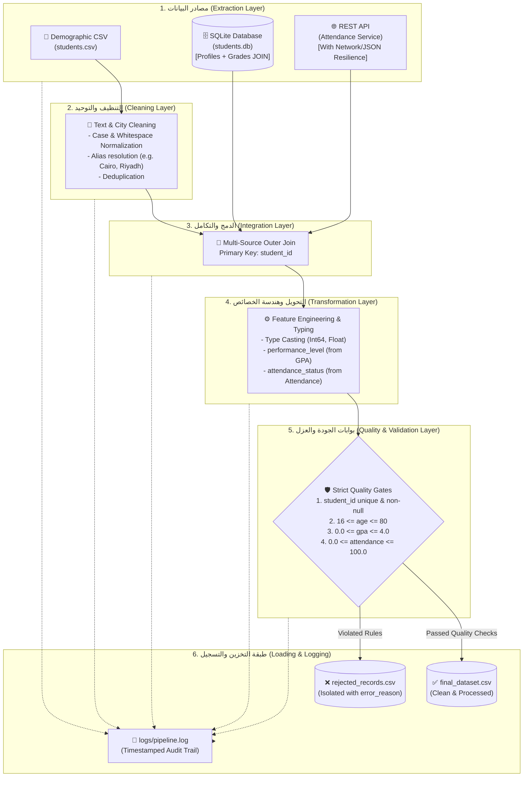

# خط أنابيب تكامل ومعالجة بيانات الطلاب (Student Data Integration & ETL Pipeline)

مشروع متكامل واحترافي في هندسة البيانات (Production-Ready Data Integration & ETL Pipeline) يهدف إلى استخراج، تنظيف، دمج، تحويل، والتحقق من جودة بيانات الطلاب المجمعة من مصادر متعددة وغير متجانسة (Heterogeneous Sources)، وفقاً لأعلى معايير هندسة البرمجيات وجودة البيانات.

---

## 1. الهيكلية المعمارية للمشروع (Architecture Overview)

يعتمد المشروع على نمط معمارية الأنابيب والمرشحات (Pipes and Filters Pattern)، حيث تمر البيانات عبر مراحل منفصلة تماماً ومستقلة وظيفياً (Decoupled Layers):



---

## 2. بنية المجلدات والملفات (Project Structure)

```text
student_data_pipeline/
│
├── app/
│   ├── __init__.py
│   ├── sources/                  # طبقة استخراج البيانات من المصادر المتعددة
│   │   ├── __init__.py
│   │   ├── csv_source.py         # قراءة ملفات CSV الأولية باستخدام pandas
│   │   ├── api_source.py         # الاتصال بـ REST API ومعالجة أخطاء الشبكة والـ JSON
│   │   └── database_source.py    # استخراج البيانات عبر استعلامات SQL Relational JOIN
│   │
│   ├── transformation/           # طبقة التنظيف، التحويل، والدمج
│   │   ├── __init__.py
│   │   ├── cleaner.py            # توحيد المدن والنصوص وحذف التكرارات
│   │   ├── transformer.py        # إنشاء الأعمدة المشتقة (performance_level & attendance_status)
│   │   └── integration.py        # دمج المصادر الثلاثة اعتماداً على المفتاح student_id
│   │
│   ├── validation/               # طبقة فحص الجودة وتطبيق القواعد الصارمة
│   │   ├── __init__.py
│   │   └── quality.py            # تطبيق بوابات الجودة وعزل السجلات مع ذكر error_reason
│   │
│   ├── output/                   # طبقة التصدير والتخزين النهائي
│   │   ├── __init__.py
│   │   └── csv_writer.py         # تصدير البيانات إلى ملفات CSV بتنسيق UTF-8
│   │
│   └── utils/                    # الأدوات المساعدة والمشتركة
│       ├── __init__.py
│       └── logger.py             # نظام تسجيل موحد للكونسول وملف logs/pipeline.log
│
├── data/
│   ├── raw/                      # البيانات الأولية التجريبية
│   │   └── students.csv          # عينة بيانات ديموغرافية للطلاب
│   ├── processed/                # البيانات المعالجة والمقبولة نهائياً
│   │   └── final_dataset.csv     # السجلات النظيفة المطابقة لجميع معايير الجودة
│   └── rejected/                 # السجلات المرفوضة لعدم مطابقة الشروط
│       └── rejected_records.csv  # السجلات المعزولة مع عمود توثيق أسباب الرفض (error_reason)
│
├── database/                     # قاعدة بيانات علائقية محلية
│   └── students.db               # قاعدة بيانات SQLite بجداول مربوطة بمفتاح student_id
│
├── tests/                        # الاختبارات الآلية (Unit & Integration Tests)
│   ├── __init__.py
│   └── test_pipeline.py          # اختبارات الجودة والاستخراج والتنظيف والتحويل
│
├── logs/                         # سجلات تتبع سير العمليات (Audit Logging)
│   └── pipeline.log              # ملف السجلات بتنسيق زمني واضح
│
├── main.py                       # نقطة الانطلاق الرئيسية لتشغيل خط الأنابيب (Orchestrator)
├── requirements.txt              # الحزم والمكتبات المعتمدة للمشروع
└── README.md                     # التوثيق الشامل والإجابة على الأسئلة التحليلية
```

---

## 3. متطلبات التثبيت والتشغيل (Installation & Execution)

### 3.1 تهيئة بيئة العمل الافتراضية
```bash
# إنشاء البيئة الافتراضية
python -m venv venv

# تفعيل البيئة:
# على Windows (PowerShell):
venv\Scripts\Activate.ps1
# على Linux / macOS:
source venv/bin/activate
```

### 3.2 تثبيت الحزم المطلوبة
```bash
pip install -r requirements.txt
```

### 3.3 تشغيل خط أنابيب البيانات (ETL Execution)
```bash
python main.py
```

### 3.4 تشغيل الاختبارات الآلية (Running Unit Tests)
```bash
python -m pytest -v
```

---

## 4. شرح تفصيلي لمخرجات خط الأنابيب (Pipeline Outputs)

1. **الملف النظيف `data/processed/final_dataset.csv`**:
   - يحتوي على كافة سجلات الطلاب التي اجتازت بنجاح جميع بوابات الجودة والتنظيف.
   - يتضمن الأعمدة المدمجة من المصادر الثلاثة:
     `student_id`, `name`, `age`, `city`, `email`, `major`, `enrollment_year`, `gpa`, `total_credits`, `attendance_rate`, `performance_level`, `attendance_status`.
   - تم توحيد أسماء المدن (مثل تحويل `cairo` أو `CAIRO` إلى `Cairo`).
   - تم حساب الأعمدة المشتقة بدقة:
     - `performance_level`: تصنيف المعدل التراكمي (Excellent, Very Good, Good, Satisfactory, Academic Probation).
     - `attendance_status`: تصنيف نسبة الحضور (Regular, Needs Improvement, Critical Warning).

2. **ملف السجلات المرفوضة `data/rejected/rejected_records.csv`**:
   - يحتوي على السجلات المعطوبة أو المخالفة للقواعد مع توضيح سبب الرفض بالتفصيل داخل عمود **`error_reason`**.
   - أمثلة على السجلات المرفوضة المرصودة:
     - طالب يقل عمره عن 16 سنة (مثال: `Age out of bounds [16-80]: 12.0`).
     - طالب يزيد معدله عن 4.0 أو نسبة حضوره عن 100% (مثال: `GPA out of bounds [0.0-4.0]: 4.8; Attendance rate out of bounds [0-100]: 115.0`).
     - سجل يفتقر إلى `student_id` (مثال: `Missing student_id`).

3. **ملف السجلات `logs/pipeline.log`**:
   - تسجيل زمني دقيق لكل مرحلة، بما في ذلك عدد السجلات المستخرجة، نتائج التنظيف، محاولات استدعاء الـ API وحالات السقوط، وإحصائيات القبول والرفض النهائية.

---

## 5. الإجابات التحليلية المفصلة للتكليف الأكاديمي (Analytical Questions)

### السؤال الأول: ما هو الفرق الجوهري بين البيانات الأولية (Raw Data) والبيانات المعالجة (Processed Data)؟ ولماذا لا يُنصح بتطبيق التحليلات أو نماذج التعلم الآلي مباشرة على البيانات الأولية؟

#### 1. المقارنة الجوهرية:

| وجه المقارنة | البيانات الأولية (Raw Data) | البيانات المعالجة (Processed Data) |
| :--- | :--- | :--- |
| **الحالة والأصل** | بيانات غير منقحة تؤخذ كما هي من المصادر (Immutable Source of Truth). | بيانات مرت بسلسلة معالجات (تنظيف، توحيد، تحويل، ودمج). |
| **الجودة والموثوقية** | تحوي قيماً مفقودة، تكرارات، أخطاء إملائية، وشذوذاً رقمياً. | تخضع لبوابات فحص الجودة (Validation Gates) وخالية من الشوائب. |
| **البنية والاتساق** | غير متجانسة وتختلف صيغها ومفاهيمها بين مصدر وآخر. | ذات مخطط موحد (Unified Schema) وأنواع بيانات مدققة وصارمة. |
| **الاستخدام المستهدف** | الحفظ المؤقت والأرشفة ولأغراض التدقيق التاريخي وإعادة المعالجة. | التحليل الإحصائي، لوحات الأعمال (BI Dashboards)، وتدريب نماذج الـ AI/ML. |

#### 2. مخاطر بناء التحليلات ونماذج الذكاء الاصطناعي مباشرة على البيانات الأولية:
1. **مبدأ "المدخلات الفاسدة تؤدي إلى مخرجات فاسدة" (Garbage In, Garbage Out - GIGO):**
   - إذا تم تغذية نموذج تنبؤي ببيانات تحتوي على أعمار شاذة (مثل عمر 95 لطالب في مرحلة بكالوريوس أو معدل 4.8 من أصل 4.0)، فإن الأوزان الرياضية للنموذج ستنحرف (Weight Distortion)، مما يعطي نتائج واستنتاجات مضللة.
2. **عدم استقرار الأنظمة البرمجية (System Crashing):**
   - يؤدي وجود نصوص في أعمدة رقمية أو قيم فارغة (`NaN` أو مسافات خالية) إلى حدوث استثناءات غير متوقعة (`TypeErrors` و `NullPointerExceptions`) أثناء العمليات الحسابية أو تشغيل لوحات الـ BI.
3. **التحيز والتكرار غير العادل (Data Bias & Duplicate Skewing):**
   - تكرار السجلات في البيانات الخام يؤدي إلى تضخيم فئات معينة حسابياً، مما يشوه مؤشرات الأداء الحقيقية (KPIs).

---

### السؤال الثاني: ما هي أهمية التحقق من جودة البيانات (Data Validation) في خطوط أنابيب هندسة البيانات؟ وما هي أبعاد الجودة الرئيسية؟

تعد مرحلة التحقق من الجودة خط الدفاع الأول عن مصداقية قرارات المؤسسة وأصولها الرقمية. غياب هذه المرحلة يحول خط الأنابيب إلى مجرد "ممر لنقل الأخطاء" بدلاً من كونه أداة لتعظيم القيمة.

#### الأبعاد الستة الرئيسية لجودة البيانات (The 6 Dimensions of Data Quality):
1. **الاكتمال (Completeness):** التأكد من عدم فقدان الحقول الحيوية المحددة للكيان، مثل التأكد من عدم فراغ `student_id`.
2. **التفرد (Uniqueness):** ضمان عدم تكرار الهوية ذاتها أكثر من مرة لكيان واحد، لمنع الحساب المزدوج للطلاب.
3. **الصلاحية والمطابقة (Validity):** مطابقة القيم لقواعد العمل والنطاقات المنطقية، مثل (أن يكون العمر بين 16 و 80، والـ GPA بين 0.0 و 4.0).
4. **الدقة (Accuracy):** مطابقة القيم للحقيقة الواقعية دون تلاعب أو تشويش حسابي.
5. **الاتساق (Consistency):** توافق البيانات عند دمجها من مصادر متعددة (عدم وجود تعارض بين الاسم في CSV والاسم في قاعدة البيانات).
6. **التوقيت الزمني (Timeliness):** وصول البيانات في الوقت المناسب للاستفادة منها في اتخاذ القرار.

---

### السؤال الثالث: مقارنة معمارية وهندسية بين المعالجة الدفعية (Batch Processing) والمعالجة اللحظية/المتدفقة (Streaming Processing)

| وجه المقارنة | المعالجة الدفعية (Batch Processing) | المعالجة المتدفقة (Streaming Processing) |
| :--- | :--- | :--- |
| **مفهوم التشغيل** | معالجة كتل ضخمة من البيانات في فترات زمنية مجدولة (ليلياً، أسبوعياً). | معالجة الأحداث لحظة وقوعها حدثاً بحدث (Event-driven / Continuous). |
| **زمن الاستجابة (Latency)** | يتراوح بين دقائق وساعات وأحياناً أيام. | لحظي (Real-time)، من أجزاء من الثانية إلى ثوانٍ معدودة. |
| **حجم البيانات (Data Scope)** | كامل البيانات التراكمية التاريخية للمجموعة (Bounded Dataset). | تدفق لا نهائي من البيانات المستمرة (Unbounded Data Stream). |
| **التعقيد المعماري والتكلفة** | أبسط هندسياً وأقل تكلفة، وتستغل فترات انخفاض الحمل الحسابي. | تتطلب بنية تحتية معقدة ومراقبة دائمة وتكلفة تشغيلية أعلى. |
| **أمثلة الأدوات والتقنيات** | Apache Spark, AWS Glue, dbt, SQL Stored Procedures. | Apache Kafka, Apache Flink, Spark Streaming, AWS Kinesis. |
| **حالات الاستخدام المثلى** | تقارير الرواتب، حساب المعدلات الفصلية للطلاب، تدريب نماذج الـ AI الدورية. | كشف الاحتيال المالي، تتبع أساطيل النقل، مراقبة أجهزة IoT الحيوية. |

---

### السؤال الرابع: ما هي أفضل الممارسات والاستراتيجيات الهندسية للتعامل مع السجلات المعطوبة (Defective/Rejected Records)؟

في أنظمة هندسة البيانات الحديثة، توجد ثلاث استراتيجيات رئيسية:

1. **الحذف والإسقاط (Dropping):**
   - *الآلية*: إهمال وحذف السجل المخالف دون تسجيل.
   - *التقييم*: غير مرغوبة في بيئات الإنتاج، لأنها تتسبب في فقدان غير مرئي للبيانات وتمنع مسؤولي المصادر من معرفة الأخطاء وتصحيحها.
2. **التعويض والتقدير (Imputation):**
   - *الآلية*: استبدال القيم المفقودة أو الشاذة بمتوسط أو وسيط حسابي أو قيمة افتراضية.
   - *التقييم*: مفيدة فقط في حقول معينة غير حرجة (مثل وضع مدينة "Unknown")، ولكنها خطيرة جداً في الحقول المعرّفة (مثل تعويض `student_id` المفقود).
3. **العزل والتخزين في طابور السجلات المعطوبة (Dead Letter Queue / Rejected Storage) - الاستراتيجية المطبقة هنا:**
   - *الآلية*: توجيه السجلات المخالفة إلى مخزن معزول (`data/rejected/rejected_records.csv`) مع توثيق سبب الخطأ تفصيلياً في عمود `error_reason`.
   - *المزايا*:
     - **قابلية التدقيق الكاملة (Full Auditability):** لا تضيع أي بيانات من المصادر الأولية.
     - **إمكانية إعادة المعالجة (Reprocessing Capability):** بمجرد تصحيح الخطأ من قِبل الفريق المسؤول، يمكن إعادة إدخال هذه السجلات في الـ Pipeline.
     - **الحفاظ على سلامة البيانات المقبولة:** ضمان عدم تسرب أي بيانات مشوهة للمستودع النهائي.

---

### السؤال الخامس: ما هو انحراف المخطط (Schema Drift) وكيف تؤثر حوكمة البيانات (Data Governance) على استقرار الـ Pipeline؟

#### 1. مفهوم انحراف المخطط (Schema Drift):
هو التغير غير المتوقع أو التدريجي في بنية البيانات الواردة من المصادر الخارجية، مثل:
- تغيير اسم عمود (مثال: تغيير `student_id` إلى `id` أو `std_id`).
- إضافة أعمدة جديدة لم تكن موجودة.
- حذف عمود أساسي يعتمد عليه خط الأنابيب.
- تغير نوع البيانات (مثال: إرسال الـ `gpa` كنص `"Four"` بدلاً من رقم عشري `4.0`).

#### 2. دور حوكمة البيانات في التصدي لانحراف المخطط:
- **عقود البيانات (Data Contracts):** اتفاقية رسمية وملزمة بين منتجي البيانات (Data Producers) ومستهلكي البيانات (Data Consumers) تمنع إجراء تعديلات غير منسقة.
- **البرمجة الدفاعية (Defensive Programming):** كما تم في هذا المشروع، من خلال دوال التنظيف والـ Type Casting واستخدام أدوات تدقيق تمنع انهيار خط الأنابيب عند حدوث انحراف طفيف.
- **تتبع نسب البيانات (Data Lineage):** معرفة المسار الدقيق للبيانات من المنشأ حتى التقارير النهائية لتحديد أثر أي تغيير يطرأ في المصدر.
