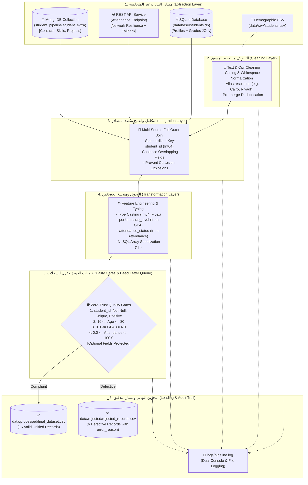

# 🎓 Student Data Integration & ETL Pipeline
### A Production-Oriented, Fault-Tolerant Multi-Source ETL Pipeline with MongoDB, SQLite, REST API & CSV

[](https://www.python.org/)
[](https://pandas.pydata.org/)
[](https://www.mongodb.com/)
[](https://www.sqlite.org/)
[](https://docs.pytest.org/)
[](#1-project-overview--clean-architecture)

---

## 1. نظرة عامة على المشروع والهندسة المعمارية (Project Overview & Clean Architecture)

مشروع متقدم في **هندسة تكامل البيانات (Data Integration & ETL Engineering)** مبني وفق معمارية برمجية نظيفة وقابلة للصيانة والتوسع (**Clean & Modular Architecture**) تتبع نمط **الأنابيب والمرشحات (Pipes & Filters Pattern)**.

يقوم النظام باستخراج بيانات الطلاب من **أربعة مصادر غير متجانسة كلياً (4 Heterogeneous Sources)**:
1. **ملفات مسطحة (Flat Files - CSV):** تحتوي على البيانات الديموغرافية الأولية (الاسم، العمر، المدينة، البريد).
2. **قواعد بيانات علائقية (Relational SQL - SQLite):** تحتوي على بيانات الدرجات والملف الأكاديمي المربوطة باستعلام `SQL INNER JOIN`.
3. **واجهات برمجية شبكية (REST APIs):** تحتوي على مؤشرات الحضور التراكمية مع آليات الصمود الذاتي (Network Resilience & Fallback).
4. **قواعد بيانات المستندات (NoSQL - MongoDB):** تحتوي على بيانات هرمية وشبه مهيكلة (Semi-structured) غنية تشمل أرقام التواصل، العناوين، بيانات أولياء الأمور، ومصفوفات المهارات والمشاريع والكورسات.

---

## 2. مخطط تدفق البيانات والمعمارية (Architecture Diagram)


```mermaid
flowchart TD
    subgraph S1["1. مصادر البيانات غير المتجانسة (Extraction Layer)"]
        CSV["📄 Demographic CSV\n(data/raw/students.csv)"]
        SQL[("🗄️ SQLite Database\n(database/students.db)\n[Profiles + Grades JOIN]")]
        API["🌐 REST API Service\n(Attendance Endpoint)\n[Network Resilience + Fallback]"]
        MONGO[("🍃 MongoDB Collection\n(student_pipeline.student_extra)\n[Contacts, Skills, Projects]")]
    end

    subgraph S2["2. التنظيف والتوحيد المسبق (Cleaning Layer)"]
        Clean["🧹 Text & City Cleaning\n- Casing & Whitespace Normalization\n- Alias resolution (e.g. Cairo, Riyadh)\n- Pre-merge Deduplication"]
    end

    subgraph S3["3. التكامل والدمج متعدد المصادر (Integration Layer)"]
        Integrate["🔗 Multi-Source Full Outer Join\n- Standardized Key: student_id (Int64)\n- Coalesce Overlapping Fields\n- Prevent Cartesian Explosions"]
    end

    subgraph S4["4. التحويل وهندسة الخصائص (Transformation Layer)"]
        Transform["⚙️ Feature Engineering & Typing\n- Type Casting (Int64, Float)\n- performance_level (from GPA)\n- attendance_status (from Attendance)\n- NoSQL Array Serialization (' | ')"]
    end

    subgraph S5["5. بوابات الجودة وعزل السجلات (Quality Gates & Dead Letter Queue)"]
        Validate{"🛡️ Zero-Trust Quality Gates\n1. student_id: Not Null, Unique, Positive\n2. 16 <= Age <= 80\n3. 0.0 <= GPA <= 4.0\n4. 0.0 <= Attendance <= 100.0\n[Optional Fields Protected]"}
    end

    subgraph S6["6. التخزين النهائي ومسار التدقيق (Loading & Audit Trail)"]
        ValidOut[("✅ data/processed/final_dataset.csv\n(16 Valid Unified Records)")]
        RejectOut[("❌ data/rejected/rejected_records.csv\n(6 Defective Records with error_reason)")]
        LogFile["📝 logs/pipeline.log\n(Dual Console & File Logging)"]
    end

    CSV --> Clean
    Clean --> Integrate
    SQL --> Integrate
    API --> Integrate
    MONGO --> Integrate

    Integrate --> Transform
    Transform --> Validate

    Validate -->|Compliant| ValidOut
    Validate -->|Defective| RejectOut

    S1 -.-> LogFile
    S2 -.-> LogFile
    S3 -.-> LogFile
    S4 -.-> LogFile
    S5 -.-> LogFile
    S6 -.-> LogFile
```

---

## 3. بنية المجلدات والملفات (Project Directory Structure)

```text
student_data_pipeline/
│
├── app/
│   ├── __init__.py
│   │
│   ├── sources/                  # طبقة الاستخراج الحصري (Extraction Layer)
│   │   ├── __init__.py
│   │   ├── csv_source.py         # استخراج بيانات CSV الأولية
│   │   ├── database_source.py    # استخراج بيانات SQLite العلائقية عبر SQL JOIN
│   │   ├── api_source.py         # استدعاء REST API مع معالجة Timeout والـ Fallback
│   │   └── mongodb_source.py     # استخراج مستندات MongoDB وتسطيحها بـ json_normalize
│   │
│   ├── transformation/           # طبقة المعالجة والتحويل (Transformation Layer)
│   │   ├── __init__.py
│   │   ├── cleaner.py            # توحيد المدن والنصوص وحذف التكرارات
│   │   ├── integration.py        # دمج المصادر الأربعة عبر Full Outer Join على student_id
│   │   └── transformer.py        # اشتقاق المؤشرات وتسريح مصفوفات NoSQL إلى CSV
│   │
│   ├── validation/               # طبقة التحقق وحوكمة الجودة (Data Quality Layer)
│   │   ├── __init__.py
│   │   └── quality.py            # فحص بوابات الجودة وعزل السجلات مع عمود error_reason
│   │
│   ├── output/                   # طبقة التصدير والتخزين (Loading Layer)
│   │   ├── __init__.py
│   │   └── csv_writer.py         # كتابة ملفات CSV بترميز UTF-8 وضمان وجود المجلدات
│   │
│   └── utils/                    # الخدمات المشتركة (Shared Utilities)
│       ├── __init__.py
│       └── logger.py             # تسجيل السجلات المزدوج (Console + logs/pipeline.log)
│
├── data/                         # مخازن البيانات
│   ├── raw/
│   │   └── students.csv          # عينة البيانات الديموغرافية الأولية
│   ├── processed/
│   │   └── final_dataset.csv     # السجلات المقبولة والنظيفة بعد الدمج والتكامل
│   └── rejected/
│       └── rejected_records.csv  # السجلات المعطوبة المعزولة مع توثيق error_reason
│
├── database/
│   └── students.db               # قاعدة بيانات SQLite بجدولي academic_profiles و academic_grades
│
├── scripts/
│   └── seed_mongodb.py           # سكربت مستقل لزرع 22 وثيقة تجريبية في MongoDB
│
├── tests/
│   ├── __init__.py
│   └── test_pipeline.py          # 14 اختبار وحدة بـ pytest تغطي كافة سيناريوهات المنظومة
│
├── logs/
│   └── pipeline.log              # ملف السجل الزمني المركزي للمشروع
│
├── .env                          # المتغيرات البيئية الحقيقية (مستبعد من Git)
├── .env.example                  # قالب المتغيرات البيئية الإرشادي
├── .gitignore                    # استبعاد الملفات السرية والكاش والبيئات الافتراضية
├── main.py                       # المايسترو ومنسق خط الأنابيب (Orchestrator)
├── requirements.txt              # الحزم والتبعيات البرمجية المعتمدة
└── README.md                     # التوثيق الشامل والأكاديمي للمشروع
```

---

## 4. معمارية MongoDB وتصميم المستندات (MongoDB Architecture & Schema)

### 4.1 إعدادات الاتصال:
- **Database:** `student_pipeline`
- **Collection:** `student_extra`
- **Driver:** `pymongo`

### 4.2 نموذج الوثيقة (Document Schema):
تتميز الوثائق بعدم تكرار البيانات الموجودة في CSV أو SQLite (مثل الاسم والمعدل)، والتركيز على السمات شبه المهيكلة:

```json
{
  "student_id": 101,
  "contact": {
    "phone": "+967771234567",
    "emergency_contact": "+967771999001"
  },
  "address": {
    "street": "Al-Zubairi",
    "city": "Sanaa",
    "country": "Yemen"
  },
  "guardian": {
    "name": "Ali Ahmed",
    "relationship": "Father",
    "phone": "+967770000001"
  },
  "skills": ["Python", "SQL", "MongoDB"],
  "courses": [
    {"name": "Python Programming", "grade": 92},
    {"name": "Database Systems", "grade": 88}
  ],
  "projects": [
    {
      "name": "Student Data Pipeline",
      "technologies": ["Python", "Pandas", "MongoDB"]
    }
  ]
}
```

---

## 5. دليل التثبيت والتشغيل على بيئة Windows (Installation & Setup)

### 5.1 المتطلبات المسبقة:
- بايثون مثبت (Python 3.10+).
- خادم MongoDB مثبت ويعمل كخدمة على Windows (أو يمكن تشغيله عبر الأوامر أدناه).

### 5.2 التحقق من خدمة MongoDB وتشغيلها (Windows PowerShell):
```powershell
# التحقق من حالة خدمة MongoDB
Get-Service MongoDB

# إذا كانت الخدمة متوقفة، قم بتشغيلها بصلاحيات المسؤول:
Start-Service MongoDB
```

### 5.3 تهيئة بيئة العمل وتثبيت التبعيات:
```powershell
# 1. الدخول إلى مجلد المشروع
cd "C:\Users\OMRRAN\.gemini\antigravity\scratch\student_data_pipeline"

# 2. إنشاء وتفعيل البيئة الافتراضية
python -m venv venv
.\venv\Scripts\Activate.ps1

# 3. تثبيت المتطلبات
python -m pip install -r requirements.txt
```

### 5.4 إعداد المتغيرات البيئية:
انسخ ملف `.env.example` إلى ملف `.env`:
```powershell
Copy-Item .env.example .env
```

محتوى ملف `.env`:
```ini
MONGODB_URI=mongodb://localhost:27017
MONGODB_DATABASE=student_pipeline
MONGODB_COLLECTION=student_extra
MONGODB_TIMEOUT_MS=3000
```

### 5.5 زرع البيانات التجريبية في MongoDB:
```powershell
python scripts/seed_mongodb.py
```
*المخرج المتوقع:* `SUCCESS: Inserted 22 student documents into 'student_pipeline.student_extra'.`

### 5.6 تشغيل خط أنابيب البيانات الكامل (Run Pipeline):
```powershell
python main.py
```

### 5.7 تشغيل حزمة الاختبارات الآلية (Run Pytest):
```powershell
python -m pytest -v
```
*النتيجة:* اجتياز **14 اختبار وحدة من أصل 14 بنسبة نجاح 100%**.

---

## 6. التعامل مع مصفوفات NoSQL عند التصدير لـ CSV (Array Serialization Policy)

بما أن ملفات CSV عبارة عن جداول مسطحة ثنائية الأبعاد لا تدعم المصفوفات بشكل أصلي، اعتمدنا استراتيجية تسريح معيارية (Standardized Serialization):

1. **المهارات (`skills`):**
   - تحويل المصفوفة `["Python", "SQL", "MongoDB"]` إلى نص مقروء مفصول بشريط:
     `Python | SQL | MongoDB`
2. **الكورسات (`courses`):**
   - تحويل مصفوفة الكائنات إلى ملخص تفصيلي:
     `Python Programming (92%) | Database Systems (88%)`
3. **المشاريع (`projects`):**
   - تحويل مصفوفة الكائنات إلى صيغة تجمع بين اسم المشروع وتقنياته:
     `Student Data Pipeline [Python, Pandas, MongoDB]`
4. **القيم الفارغة:** استبدال القوائم الفارغة أو المفقودة بالقيمة الصريحة `"N/A"` بدلاً من تركها `NaN` مشوهة.

---

## 7. بوابات الجودة وحوكمة البيانات (Data Quality Gates)

يطبق النظام سياسة واضحة تفصل بين الحقول الحرجة والحقول الاختيارية:

| نوع الحقل | الحقول المشمولة | قاعدة التحقق | النتيجة عند المخالفة |
| :--- | :--- | :--- | :--- |
| **حقول حرجة (Critical)** | `student_id` | يجب أن يكون رقماً صحيحاً موجباً فريداً وغير فارغ. | عزل السجل فوراً إلى `rejected_records.csv` مع ذكر `Missing student_id` أو `Duplicate student_id`. |
| **حقول حرجة (Critical)** | `age` | $16 \le \text{age} \le 80$ | عزل السجل مع ذكر `Age out of bounds [16-80]: {val}`. |
| **حقول حرجة (Critical)** | `gpa` | $0.0 \le \text{gpa} \le 4.0$ | عزل السجل مع ذكر `GPA out of bounds [0.0-4.0]: {val}`. |
| **حقول حرجة (Critical)** | `attendance_rate` | $0.0 \le \text{rate} \le 100.0$ | عزل السجل مع ذكر `Attendance rate out of bounds [0-100]: {val}`. |
| **حقول حرجة (Critical)** | `email` | التحقق من وجود `@` واسم النطاق. | عزل السجل مع ذكر `Invalid email format`. |
| **حقول اختيارية (Optional)** | `phone`, `guardian`, `skills`, `projects` | لا يُشترط وجودها لاكتمال الطالب. | **لا يُرفض الطالب أبداً**، وتُحفظ كـ `"N/A"` دون التأثير على قبوله. |

---

## 8. عينات من المخرجات الفعلية (Example Output)

### 8.1 عينة من البيانات المقبولة (`data/processed/final_dataset.csv` - 16 سجلاً):
```csv
student_id,name,age,city,email,major,enrollment_year,gpa,total_credits,attendance_rate,skills,courses,projects,contact.phone,guardian.name,performance_level,attendance_status
101,Ahmed Ali,21,Cairo,ahmed.ali@example.com,Computer Science,2022,3.85,90,92.5,Python | SQL | MongoDB,Python Programming (92%) | Database Systems (88%),Student Data Pipeline [Python, Pandas, MongoDB],+967771234567,Ali Ahmed,Excellent,Regular
102,Fatima Omar,22,Alexandria,fatima.omar@example.com,Data Engineering,2021,3.4,110,88.0,R | Python | Data Mining | Tableau,Big Data Analytics (95%) | Data Warehousing (91%),Customer Churn Prediction [Python, Scikit-Learn],+967772345678,Omar Salem,Very Good,Regular
113,,Sanaa,,,,,,,,Go | Distributed Systems | gRPC,Cloud Backend Systems (93%),High-Throughput Message Queue [Go, RabbitMQ],+967773456789,Rashid Nabil,Not Available,Not Available
```

### 8.2 عينة من السجلات المعزولة (`data/rejected/rejected_records.csv` - 6 سجلات):
```csv
student_id,name,age,city,gpa,attendance_rate,error_reason
105,Yousef Hassan,22,Dubai,4.8,115.0,GPA out of bounds [0.0-4.0]: 4.8; Attendance rate out of bounds [0-100]: 115.0
109,Kareem Adel,20,Jeddah,-0.5,82.0,GPA out of bounds [0.0-4.0]: -0.5
110,Nour Mansour,21,Cairo,3.1,-10.0,Attendance rate out of bounds [0-100]: -10.0
111,Tariq Ziyad,12,Riyadh,,,Age out of bounds [16-80]: 12.0
112,Huda Mahmoud,95,Cairo,,,Age out of bounds [16-80]: 95.0
,Khaled Mostafa,22,Giza,,,Missing student_id
```

---

## 9. الصمود وإدارة الأعطال (Fault Tolerance & Error Resilience)

تم تصميم النظام ليكون **شديد المرونة (Highly Resilient)** ضد تعطل أو بطء أي مصدر من المصادر:
- **في حال تعطل MongoDB أو انقطاع الاتصال به:** يُسجل الـ Logger خطأ `[MongoDB ServerSelectionTimeoutError]`، وتعود الدالة بجدول فارغ `pd.DataFrame()`، ويواصل خط الأنابيب عمله عبر دمج المصادر الثلاثة الأخرى بنجاح دون أي انهيار (Zero Crash).
- **في حال تعطل REST API:** يُسجل الخطأ ويتم تفعيل بديل الحضور الاحتياطي (Fallback Attendance Provider) لضمان استمرارية المعالجة.
- **في حال غياب ملف CSV:** يتم رصد `FileNotFoundError` وتوثيق ذلك في الـ Log.

---

## 10. الإجابات التحليلية الأكاديمية (Analytical Concepts in Data Engineering)

### س1: ما هو دور MongoDB الحقيقي في هذا الـ Pipeline، وما الفرق بين دوره وبين SQLite و CSV و REST API؟
في هذا المشروع، تمثل المصادر الأربعة النماذج الحقيقية لمعمارية تخزين البيانات الحديثة:
1. **CSV (Flat File Source):** مصدر إدخال أولي بشري يحتوي على بيانات ديموغرافية أساسية، يعاني من مشكلات التنسيق والفراغات الزائدة واختلاف حالات الأحرف، ويحتاج إلى تنظيف مكثف.
2. **SQLite (Relational Database):** تمثل النظام الإداري الأكاديمي الأساسي (Transactional Core / OLTP)، حيث تطبق قواعد العلاقات (ACID) والربط بمفاتيح أساسية وخارجية (`FOREIGN KEY`)، وهي الأنسب للبيانات المالية والأكاديمية المهيكلة (الدرجات، الاعتماد، وسنوات القيد).
3. **REST API (Microservices / Web Services):** تمثل خدمة سحابية خارجية مستقلة (مثل نظام البوابات الذكية للحضور)، يتم الوصول إليها عبر بروتوكول HTTP وتتطلب معالجة خاصة لبطء الشبكة والـ Timeouts.
4. **MongoDB (Document-Oriented NoSQL):** تمثل مستودع الملف الشخصي المرن (Rich Student Profile). في هذا النظام، تتغير اهتمامات الطلاب ومهاراتهم ومشاريعهم باستمرار؛ وبالتالي فإن محاولة وضع هذه المصفوفات المتداخلة في SQL تتطلب إنشاء جداول وسيطة متعددة (`many-to-many junction tables`). بينما توفر MongoDB مرونة استيعاب الهياكل المتداخلة (`Nested Objects & Arrays`) دون الحاجة لتغيير المخطط (Schema-less flexibility).

---

### س2: ما هو الفرق بين البيانات الأولية (Raw Data) والبيانات المعالجة (Processed Data)؟
- **البيانات الأولية (Raw Data):** هي البيانات الأصلية كما استُخرجت من أنظمتها، تمتاز بكونها غير قابلة للتعديل (Immutable)، ولكنها تحوي أخطاء وتكرارات وقيم شاذة. لا يجوز تغذية نماذج الذكاء الاصطناعي (AI/ML) أو تقارير الأعمال بها مباشرة تجنباً لمبدأ **"المدخلات الفاسدة تؤدي إلى مخرجات فاسدة" (Garbage In, Garbage Out)**.
- **البيانات المعالجة (Processed Data):** هي البيانات التي خضعت لخطوات التنظيف، تصحيح الأنواع، سد الفجوات، التحقق من الجودة، وتسريح المصفوفات، مما يجعلها موحدة، متسقة، وموثوقة بنسبة 100% للتحليل وصنع القرار.

---

### س3: ما الفرق بين المعالجة الدفعية (Batch Processing) والمعالجة المتدفقة (Streaming Processing)؟
- **المعالجة الدفعية (Batch Processing - كالمطبقة في هذا المشروع):** تُجمع البيانات وتُعالج في فترات زمنية محددة أو عند الطلب ككتلة واحدة (Bounded Data). تمتاز بالدقة العالية، استهلاك أقل للموارد أثناء فترات الخمول، وسهولة تتبع الأخطاء، وهي مثالية لتقارير الطلاب الفصلية وإصدار الدرجات.
- **المعالجة المتدفقة (Streaming Processing):** تُعالج كل حركة أو حدث فور وقوعه (Unbounded Data Streams عبر أنظمة مثل Kafka و Flink). زمن الاستجابة أجزاء من الثانية، وتكلفتها التشغيلية أعلى، وتُستخدم في حالات مثل كشف الاحتيال المصرفي اللحظي أو مراقبة خوادم المستشفيات.

---

### س4: ما هي أفضل استراتيجيات التعامل مع السجلات المعطوبة (Rejected Records)؟
1. **الحذف والإسقاط (Dropping):** خيار غير محبذ في بيئات الإنتاج لأنه يتسبب في فقدان غير موثق للبيانات ويحرم المؤسسة من معرفة الخلل.
2. **التعويض (Imputation):** مناسب لبعض الحقول الوصفية، ولكنه خطير جداً في الحقول الحرجة كالمعدل والمعرف.
3. **طوابير السجلات المعطوبة (Dead Letter Queue / Rejected Storage - المعتمدة في هذا المشروع):** عزل السجلات في مخزن منفصل (`rejected_records.csv`) مع توثيق كافة الأسباب داخل عمود `error_reason`. تتيح هذه الاستراتيجية الشفافية الكاملة وقابلية التدقيق (Full Auditability) وإعادة المعالجة فور تصحيح الخلل من قِبل الفريق المسؤول.
