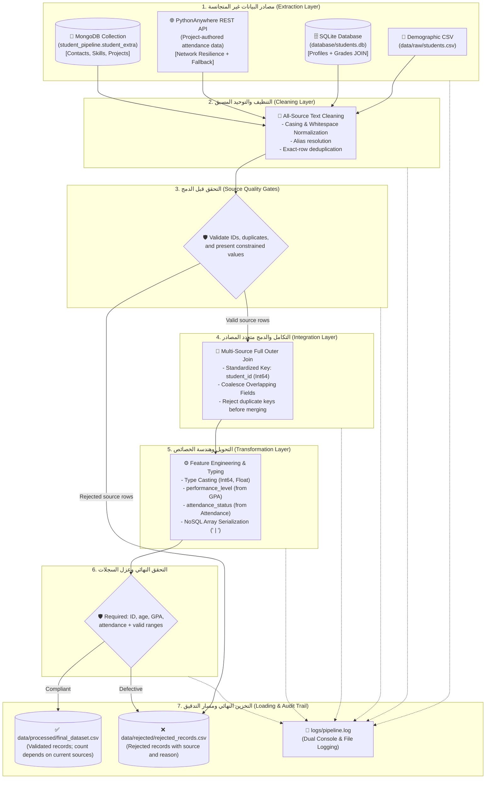

# 🎓 Student Data Integration & ETL Pipeline
### A Production-Oriented, Fault-Tolerant Multi-Source ETL Pipeline with MongoDB, SQLite, REST API & CSV

[](https://www.python.org/)
[](https://pandas.pydata.org/)
[](https://www.mongodb.com/)
[](https://www.sqlite.org/)
[](https://docs.pytest.org/)
[](#1-project-overview--clean-architecture)

---

لشرح مفصل لمراحل تدفق البيانات، وسياسة القيم الناقصة، والتحقق قبل الدمج وبعده، راجع [وثيقة المشروع التفصيلية](./PROJECT_DOCUMENTATION.md).

## 1. نظرة عامة على المشروع والهندسة المعمارية (Project Overview & Clean Architecture)

مشروع متقدم في **هندسة تكامل البيانات (Data Integration & ETL Engineering)** مبني وفق معمارية برمجية نظيفة وقابلة للصيانة والتوسع (**Clean & Modular Architecture**) تتبع نمط **الأنابيب والمرشحات (Pipes & Filters Pattern)**.

يقوم النظام باستخراج بيانات الطلاب من **أربعة مصادر غير متجانسة كلياً (4 Heterogeneous Sources)**:
1. **ملفات مسطحة (Flat Files - CSV):** تحتوي على البيانات الديموغرافية الأولية (الاسم، العمر، المدينة، البريد).
2. **قواعد بيانات علائقية (Relational SQL - SQLite):** تحتوي على بيانات الدرجات والملف الأكاديمي المربوطة باستعلام `SQL INNER JOIN`.
3. **واجهة REST API:** خدمة خارجية مستضافة على PythonAnywhere تعرض بيانات أنشأها صاحب المشروع، مع بيانات محلية احتياطية عند تعذر الطلب أو فساد JSON.
4. **قواعد بيانات المستندات (NoSQL - MongoDB):** تحتوي على بيانات هرمية وشبه مهيكلة (Semi-structured) غنية تشمل أرقام التواصل، العناوين، بيانات أولياء الأمور، ومصفوفات المهارات والمشاريع والكورسات.

---

## 2. مخطط تدفق البيانات والمعمارية (Architecture Diagram)


```mermaid
flowchart TD
    subgraph S1["1. مصادر البيانات غير المتجانسة (Extraction Layer)"]
        CSV["📄 Demographic CSV\n(data/raw/students.csv)"]
        SQL[("🗄️ SQLite Database\n(database/students.db)\n[Profiles + Grades JOIN]")]
        API["🌐 PythonAnywhere REST API\n(Project-authored attendance data)\n[Network Resilience + Fallback]"]
        MONGO[("🍃 MongoDB Collection\n(student_pipeline.student_extra)\n[Contacts, Skills, Projects]")]
    end

    subgraph S2["2. التنظيف والتوحيد المسبق (Cleaning Layer)"]
        Clean["🧹 All-Source Text Cleaning\n- Casing & Whitespace Normalization\n- Alias resolution\n- Exact-row deduplication"]
    end

    subgraph S3["3. التحقق قبل الدمج (Source Quality Gates)"]
        SourceValidate{"🛡️ Validate IDs, duplicates,\nand present constrained values"}
    end

    subgraph S4["4. التكامل والدمج متعدد المصادر (Integration Layer)"]
        Integrate["🔗 Multi-Source Full Outer Join\n- Standardized Key: student_id (Int64)\n- Coalesce Overlapping Fields\n- Reject duplicate keys before merging"]
    end

    subgraph S5["5. التحويل وهندسة الخصائص (Transformation Layer)"]
        Transform["⚙️ Feature Engineering & Typing\n- Type Casting (Int64, Float)\n- performance_level (from GPA)\n- attendance_status (from Attendance)\n- NoSQL Array Serialization (' | ')"]
    end

    subgraph S6["6. التحقق النهائي وعزل السجلات"]
        Validate{"🛡️ Required: ID, age, GPA,\nattendance + valid ranges"}
    end

    subgraph S7["7. التخزين النهائي ومسار التدقيق (Loading & Audit Trail)"]
        ValidOut[("✅ data/processed/final_dataset.csv\n(Validated records; count depends on current sources)")]
        RejectOut[("❌ data/rejected/rejected_records.csv\n(Rejected records with source and reason)")]
        LogFile["📝 logs/pipeline.log\n(Dual Console & File Logging)"]
    end

    CSV --> Clean
    SQL --> Clean
    API --> Clean
    MONGO --> Clean

    Clean --> SourceValidate
    SourceValidate -->|Valid source rows| Integrate
    SourceValidate -->|Rejected source rows| RejectOut
    Integrate --> Transform
    Transform --> Validate

    Validate -->|Compliant| ValidOut
    Validate -->|Defective| RejectOut

    S1 -.-> LogFile
    S2 -.-> LogFile
    S3 -.-> LogFile
    S4 -.-> LogFile
    S5 -.-> LogFile
    S6 -.-> LogFile
```

---

## 3. بنية المجلدات والملفات (Project Directory Structure)

```text
student_data_pipeline/
│
├── app/
│   ├── __init__.py
│   │
│   ├── sources/                  # طبقة الاستخراج الحصري (Extraction Layer)
│   │   ├── __init__.py
│   │   ├── csv_source.py         # استخراج بيانات CSV الأولية
│   │   ├── database_source.py    # استخراج بيانات SQLite العلائقية عبر SQL JOIN
│   │   ├── api_source.py         # استدعاء REST API مع معالجة Timeout والـ Fallback
│   │   └── mongodb_source.py     # استخراج مستندات MongoDB وتسطيحها بـ json_normalize
│   │
│   ├── transformation/           # طبقة المعالجة والتحويل (Transformation Layer)
│   │   ├── __init__.py
│   │   ├── cleaner.py            # توحيد المدن والنصوص وحذف التكرارات
│   │   ├── integration.py        # دمج المصادر الأربعة عبر Full Outer Join على student_id
│   │   └── transformer.py        # اشتقاق المؤشرات وتسريح مصفوفات NoSQL إلى CSV
│   │
│   ├── validation/               # طبقة التحقق وحوكمة الجودة (Data Quality Layer)
│   │   ├── __init__.py
│   │   └── quality.py            # فحص بوابات الجودة وعزل السجلات مع عمود error_reason
│   │
│   ├── output/                   # طبقة التصدير والتخزين (Loading Layer)
│   │   ├── __init__.py
│   │   └── csv_writer.py         # كتابة ملفات CSV بترميز UTF-8 وضمان وجود المجلدات
│   │
│   └── utils/                    # الخدمات المشتركة (Shared Utilities)
│       ├── __init__.py
│       └── logger.py             # تسجيل السجلات المزدوج (Console + logs/pipeline.log)
│
├── data/                         # مخازن البيانات
│   ├── raw/
│   │   └── students.csv          # عينة البيانات الديموغرافية الأولية
│   ├── processed/
│   │   └── final_dataset.csv     # السجلات المقبولة والنظيفة بعد الدمج والتكامل
│   └── rejected/
│       └── rejected_records.csv  # السجلات المعطوبة المعزولة مع توثيق error_reason
│
├── database/
│   └── students.db               # قاعدة بيانات SQLite بجدولي academic_profiles و academic_grades
│
├── scripts/
│   └── seed_mongodb.py           # سكربت مستقل لزرع 22 وثيقة تجريبية في MongoDB
│
├── tests/
│   ├── __init__.py
│   └── test_pipeline.py          # اختبارات pytest لطبقات الاستخراج والمعالجة والتصدير
│
├── logs/
│   └── pipeline.log              # ملف السجل الزمني المركزي للمشروع
│
├── .env                          # المتغيرات البيئية الحقيقية (مستبعد من Git)
├── .env.example                  # قالب المتغيرات البيئية الإرشادي
├── .gitignore                    # استبعاد الملفات السرية والكاش والبيئات الافتراضية
├── main.py                       # المايسترو ومنسق خط الأنابيب (Orchestrator)
├── requirements.txt              # الحزم والتبعيات البرمجية المعتمدة
└── README.md                     # التوثيق الشامل والأكاديمي للمشروع
```

---

## 4. معمارية MongoDB وتصميم المستندات (MongoDB Architecture & Schema)

### 4.1 إعدادات الاتصال:
- **Database:** `student_pipeline`
- **Collection:** `student_extra`
- **Driver:** `pymongo`

### 4.2 نموذج الوثيقة (Document Schema):
تتميز الوثائق بعدم تكرار البيانات الموجودة في CSV أو SQLite (مثل الاسم والمعدل)، والتركيز على السمات شبه المهيكلة:

```json
{
  "student_id": 101,
  "contact": {
    "phone": "+967771234567",
    "emergency_contact": "+967771999001"
  },
  "address": {
    "street": "Al-Zubairi",
    "city": "Sanaa",
    "country": "Yemen"
  },
  "guardian": {
    "name": "Ali Ahmed",
    "relationship": "Father",
    "phone": "+967770000001"
  },
  "skills": ["Python", "SQL", "MongoDB"],
  "courses": [
    {"name": "Python Programming", "grade": 92},
    {"name": "Database Systems", "grade": 88}
  ],
  "projects": [
    {
      "name": "Student Data Pipeline",
      "technologies": ["Python", "Pandas", "MongoDB"]
    }
  ]
}
```

---

## 5. دليل التثبيت والتشغيل على بيئة Windows (Installation & Setup)

### 5.1 المتطلبات المسبقة:
- بايثون مثبت (Python 3.10+).
- خادم MongoDB مثبت ويعمل كخدمة على Windows (أو يمكن تشغيله عبر الأوامر أدناه).

### 5.2 التحقق من خدمة MongoDB وتشغيلها (Windows PowerShell):
```powershell
# التحقق من حالة خدمة MongoDB
Get-Service MongoDB

# إذا كانت الخدمة متوقفة، قم بتشغيلها بصلاحيات المسؤول:
Start-Service MongoDB
```

### 5.3 تهيئة بيئة العمل وتثبيت التبعيات:
```powershell
# 1. الدخول إلى مجلد المشروع
cd "C:\Users\OMRRAN\.gemini\antigravity\scratch\student_data_pipeline"

# 2. إنشاء وتفعيل البيئة الافتراضية
python -m venv venv
.\venv\Scripts\Activate.ps1

# 3. تثبيت المتطلبات
python -m pip install -r requirements.txt
```

### 5.4 إعداد المتغيرات البيئية:
انسخ ملف `.env.example` إلى ملف `.env`:
```powershell
Copy-Item .env.example .env
```

محتوى ملف `.env`:
```ini
MONGODB_URI=mongodb://localhost:27017
MONGODB_DATABASE=student_pipeline
MONGODB_COLLECTION=student_extra
MONGODB_TIMEOUT_MS=3000
```

### 5.5 زرع البيانات التجريبية في MongoDB:
```powershell
python scripts/seed_mongodb.py
```
*المخرج المتوقع:* `SUCCESS: Inserted 22 student documents into 'student_pipeline.student_extra'.`

### 5.6 تشغيل خط أنابيب البيانات الكامل (Run Pipeline):
```powershell
python main.py
```

### 5.7 تشغيل حزمة الاختبارات الآلية (Run Pytest):
```powershell
python -m pytest -v
```
تعرض نتيجة الأمر عدد الاختبارات وحالتها في بيئة التشغيل الحالية.

---

## 6. التعامل مع مصفوفات NoSQL عند التصدير لـ CSV (Array Serialization Policy)

بما أن ملفات CSV عبارة عن جداول مسطحة ثنائية الأبعاد لا تدعم المصفوفات بشكل أصلي، اعتمدنا استراتيجية تسريح معيارية (Standardized Serialization):

1. **المهارات (`skills`):**
   - تحويل المصفوفة `["Python", "SQL", "MongoDB"]` إلى نص مقروء مفصول بشريط:
     `Python | SQL | MongoDB`
2. **الكورسات (`courses`):**
   - تحويل مصفوفة الكائنات إلى ملخص تفصيلي:
     `Python Programming (92%) | Database Systems (88%)`
3. **المشاريع (`projects`):**
   - تحويل مصفوفة الكائنات إلى صيغة تجمع بين اسم المشروع وتقنياته:
     `Student Data Pipeline [Python, Pandas, MongoDB]`
4. **القيم الفارغة:** استبدال القوائم الفارغة أو المفقودة بالقيمة الصريحة `"N/A"` بدلاً من تركها `NaN` مشوهة.

---

## 7. بوابات الجودة وحوكمة البيانات (Data Quality Gates)

يطبق النظام فحصًا لكل مصدر قبل الدمج، ثم فحصًا نهائيًا بعد الدمج. لا يقبل الناتج النهائي السجل إذا نقص المعرّف أو العمر أو GPA أو الحضور؛ لا يجري تعويضها بقيم إحصائية. الحقول الإضافية مثل الهاتف والعنوان والوصي والمهارات اختيارية وتبقى فارغة عند عدم توفرها.

| نوع الحقل | الحقول المشمولة | قاعدة التحقق | النتيجة عند المخالفة |
| :--- | :--- | :--- | :--- |
| الحقل | القاعدة | النتيجة عند المخالفة |
| :--- | :--- | :--- |
| `student_id` | مطلوب، صحيح، موجب، وفريد داخل كل مصدر. | رفض صف المصدر وتسجيل المصدر والسبب. |
| `age` | مطلوب في الناتج النهائي، عدد صحيح بين 16 و80. | رفض صف المصدر عند قيمة غير صالحة؛ رفض الطالب النهائي إن بقيت القيمة ناقصة. |
| `gpa` | مطلوب في الناتج النهائي وبين 0 و4. | رفض القيمة غير الصالحة في المصدر؛ رفض الناتج النهائي إن بقيت ناقصة. |
| `attendance_rate` | مطلوب في الناتج النهائي وبين 0 و100. | رفض القيمة غير الصالحة في المصدر؛ رفض الناتج النهائي إن بقيت ناقصة. |
| `score` | عند وجود العمود، يجب أن يكون بين 0 و100. | رفض الصف إذا خالف الحد. |
| `email` | اختياري؛ إن توفر يجب أن يحتوي `@` ونقطة في النطاق. | رفض الصف إذا كانت القيمة غير صالحة. |
| حقول الملف الإضافي | اختيارية ولا تمنع القبول عند غيابها. | تبقى فارغة أو `N/A` بحسب نوع الحقل. |

---

## 8. عينات من المخرجات الفعلية (Example Output)

### 8.1 مثال توضيحي لبيانات مقبولة (`data/processed/final_dataset.csv`)
```csv
student_id,name,age,email,contact.phone,address.street,address.city,address.country,major,enrollment_year,gpa,total_credits,attendance_rate,performance_level,attendance_status,skills,courses,projects,guardian.name,guardian.relationship,guardian.phone
101,Ahmed Ali,21,ahmed.ali@example.com,+967771234567,Corniche Road,Aden,Yemen,Computer Science,2022,3.85,90,92.5,Excellent,Regular,Python | SQL,Database Systems (90%),Pipeline [Python],Omar Salem,Father,+967770000002
```

السجل المقبول يجب أن يحتوي على `student_id` و`age` و`gpa` و`attendance_rate` صالحة؛ الأعداد الفعلية تتغير بحسب المصادر المتاحة وقت التشغيل.

### 8.2 مثال توضيحي لسجل مرفوض (`data/rejected/rejected_records.csv`)
```csv
student_id,age,gpa,attendance_rate,source_name,rejection_stage,error_reason
105,22,4.8,,SQLite,source_validation,"GPA out of bounds [0-4]: 4.8"
113,,3.4,90.0,integrated,final_validation,Missing required field: age
```

قد تختلف أعمدة ملف الرفض لأن صفوفه يمكن رفضها من مصادر مختلفة أو بعد الدمج.

---

## 9. الصمود وإدارة الأعطال (Fault Tolerance & Error Resilience)

يتعامل النظام مع بعض أعطال المصادر مع تسجيلها، لكن لا يتجاوز كل خطأ:
- **تعذر MongoDB:** تسجل وحدة المصدر الخطأ وتعيد جدولًا فارغًا، ثم يحاول الخط متابعة المعالجة بالمصادر الأخرى؛ وقد يرفض الفحص النهائي سجلات الطلاب التي ينقصها حقل أساسي نتيجة غياب المصدر.
- **تعذر REST API أو JSON غير صالح:** يسجل الخطأ ويستخدم بيانات الحضور الاحتياطية افتراضيًا. استجابة JSON سليمة لكنها فارغة لا تستبدل بالـfallback.
- **غياب ملف CSV أو قاعدة SQLite أو فشل التصدير:** يرفع خطأ ويوقف التشغيل بدل الإبلاغ عن نجاح زائف.

---

## 10. الإجابات التحليلية الأكاديمية (Analytical Concepts in Data Engineering)

### س1: ما هو دور MongoDB الحقيقي في هذا الـ Pipeline، وما الفرق بين دوره وبين SQLite و CSV و REST API؟
في هذا المشروع، تمثل المصادر الأربعة أنماطًا مختلفة لتخزين وتبادل البيانات:
1. **CSV (Flat File Source):** مصدر إدخال أولي بشري يحتوي على بيانات ديموغرافية أساسية، يعاني من مشكلات التنسيق والفراغات الزائدة واختلاف حالات الأحرف، ويحتاج إلى تنظيف مكثف.
2. **SQLite (Relational Database):** تمثل النظام الإداري الأكاديمي الأساسي (Transactional Core / OLTP)، حيث تطبق قواعد العلاقات (ACID) والربط بمفاتيح أساسية وخارجية (`FOREIGN KEY`)، وهي الأنسب للبيانات المالية والأكاديمية المهيكلة (الدرجات، الاعتماد، وسنوات القيد).
3. **REST API (Microservices / Web Services):** خدمة خارجية مستضافة على PythonAnywhere وتعرض بيانات حضور أنشأها صاحب المشروع؛ يصل إليها الخط عبر HTTP مع معالجة للمهلة وأخطاء الطلب وبديل محلي.
4. **MongoDB (Document-Oriented NoSQL):** تمثل مستودع الملف الشخصي المرن (Rich Student Profile). في هذا النظام، تتغير اهتمامات الطلاب ومهاراتهم ومشاريعهم باستمرار؛ وبالتالي فإن محاولة وضع هذه المصفوفات المتداخلة في SQL تتطلب إنشاء جداول وسيطة متعددة (`many-to-many junction tables`). بينما توفر MongoDB مرونة استيعاب الهياكل المتداخلة (`Nested Objects & Arrays`) دون الحاجة لتغيير المخطط (Schema-less flexibility).

---

### س2: ما هو الفرق بين البيانات الأولية (Raw Data) والبيانات المعالجة (Processed Data)؟
- **البيانات الأولية (Raw Data):** هي البيانات الأصلية كما استُخرجت من أنظمتها، تمتاز بكونها غير قابلة للتعديل (Immutable)، ولكنها تحوي أخطاء وتكرارات وقيم شاذة. لا يجوز تغذية نماذج الذكاء الاصطناعي (AI/ML) أو تقارير الأعمال بها مباشرة تجنباً لمبدأ **"المدخلات الفاسدة تؤدي إلى مخرجات فاسدة" (Garbage In, Garbage Out)**.
- **البيانات المعالجة (Processed Data):** هي السجلات التي نُظفت ووُحدت أنواعها وتحققت قواعد جودتها. لا يعوض هذا المشروع القيم الأساسية الناقصة إحصائيًا؛ بل يعزل السجل إذا بقي العمر أو المعدل أو الحضور مفقودًا بعد الدمج. لذلك لا تعني المعالجة أن البيانات خالية من كل نقص، أو أنها مضمونة الصحة المطلقة.

---

### س3: ما الفرق بين المعالجة الدفعية (Batch Processing) والمعالجة المتدفقة (Streaming Processing)؟
- **المعالجة الدفعية (Batch Processing - كالمطبقة في هذا المشروع):** تُجمع البيانات وتُعالج في فترات زمنية محددة أو عند الطلب ككتلة واحدة (Bounded Data). تمتاز بالدقة العالية، استهلاك أقل للموارد أثناء فترات الخمول، وسهولة تتبع الأخطاء، وهي مثالية لتقارير الطلاب الفصلية وإصدار الدرجات.
- **المعالجة المتدفقة (Streaming Processing):** تُعالج كل حركة أو حدث فور وقوعه (Unbounded Data Streams عبر أنظمة مثل Kafka و Flink). زمن الاستجابة أجزاء من الثانية، وتكلفتها التشغيلية أعلى، وتُستخدم في حالات مثل كشف الاحتيال المصرفي اللحظي أو مراقبة خوادم المستشفيات.

---

### س4: ما هي أفضل استراتيجيات التعامل مع السجلات المعطوبة (Rejected Records)؟
1. **الحذف والإسقاط (Dropping):** خيار غير محبذ في بيئات الإنتاج لأنه يتسبب في فقدان غير موثق للبيانات ويحرم المؤسسة من معرفة الخلل.
2. **التعويض (Imputation):** قد يناسب بعض التحليلات بعد توثيق قاعدة العمل، لكنه غير مطبق هنا على الحقول الأساسية لتجنب إنشاء قيم غير مرصودة.
3. **عزل السجلات المرفوضة (Rejected Storage):** تحفظ السجلات في `rejected_records.csv` مع `source_name` و`rejection_stage` و`error_reason` لتوضيح موضع اكتشاف الخلل وتمكين مراجعتها وإعادة معالجتها بعد التصحيح.

### س5: ما المشكلات التي عالجها الدمج متعدد المصادر؟
قد يختلف نوع `student_id` بين CSV وقاعدة البيانات وJSON وMongoDB، وقد توجد مفاتيح مفقودة أو مكررة أو صفوف لطالب في مصدر دون غيره. يوحد المشروع صيغة المفتاح، ويرفض السجلات ذات المفاتيح غير الصالحة أو المكررة داخل المصدر، ثم يستخدم `outer join` للاحتفاظ بالسجلات المتاحة. يفشل الدمج المباشر برسالة واضحة عند غياب المفتاح بدل إلحاق صفوف لا يمكن مطابقتها.

### س6: كيف تُعالج القيم المفقودة؟
لا يجري ملء العمر أو GPA أو الحضور بمتوسط أو وسيط. يسمح فحص المصدر بغياب الحقول التي قد يوفرها مصدر آخر، ثم يجمع الدمج القيم المتاحة؛ إذا بقي أحد الحقول الأساسية (`student_id`, `age`, `gpa`, `attendance_rate`) ناقصًا، يرفض الفحص النهائي السجل ويسجل السبب. الحقول الإضافية مثل الهاتف والوصي والمهارات اختيارية.

### س7: كيف تُعالج التكرارات؟
يزيل التنظيف الصفوف المتطابقة تمامًا بعد توحيد النصوص، ويسجل عددها. أما وجود `student_id` نفسه في صفوف مختلفة داخل المصدر فيؤدي إلى رفض السجلات المتعارضة وبيان السبب، بدل اختيار أحدها بصمت.

### س8: كيف تُعالج السجلات غير الصالحة؟
تفحص المصادر المعرّف والقيم المقيدة المتاحة قبل الدمج، ثم يفحص الناتج اكتمال الحقول الأساسية وحدودها. تحفظ حالات الرفض في `rejected_records.csv` مع المصدر ومرحلة الفحص وسبب الرفض، بينما تصدر السجلات المجتازة فقط إلى `final_dataset.csv`.

### س9: لماذا تُفصل طبقة الاستخراج عن التحويل؟
الفصل يجعل كل قارئ مسؤولًا عن الوصول إلى مصدره فقط، ويتيح اختبار CSV وSQLite وAPI وMongoDB كلًا على حدة. كما يسمح بتعديل طريقة الوصول أو إضافة مصدر دون وضع تفاصيل الاتصال والقراءة داخل منطق التنظيف والدمج.

### س10: لماذا يعد التحقق من الجودة أساسيًا؟
لأنه يمنع استخدام معرفات غير قابلة للمطابقة أو أعمار ومعدلات خارج الحدود في التحليل والتقارير، ويوفر سجلًا قابلًا للمراجعة للأخطاء بدل إسقاطها دون تفسير.

### س11: كيف يمكن تطوير المشروع للتشغيل الدوري والتعامل مع ملايين السجلات؟
يمكن جدولة `python main.py` عبر Windows Task Scheduler، مع إضافة مراقبة للتشغيل والتنبيه عند الفشل. أما الأحجام الكبيرة فتحتاج إلى قراءة CSV على دفعات، وطلب صفحات API، واستخدام استعلامات محدودة/دفع التحويلات إلى قواعد البيانات، والكتابة التدريجية أو محرك موزع مثل Spark؛ التنفيذ الحالي يحمل الجداول كاملة في ذاكرة pandas، لذا لا يدعي دعم ملايين السجلات حاليًا.
